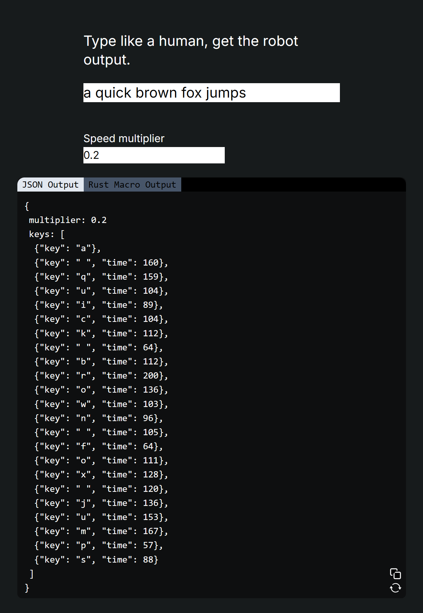

# robotype
Type out a string of characters and get a JSON object with data about your typing speed back. This is meant to allow bots to scrape
sites and pass captchas on input fields.

## Stack
This is a [Next.js](https://nextjs.org/) that only uses client rendering. I could've written this in React and achieved the same purpose, however, I want to host this at sometime in the future so it being written in Next is convenient for that.

## Running
On your local computer, just run `yarn` to install dependencies and then `yarn dev` and you'll have a local dev server running!
Thats it, it's pretty simple.

